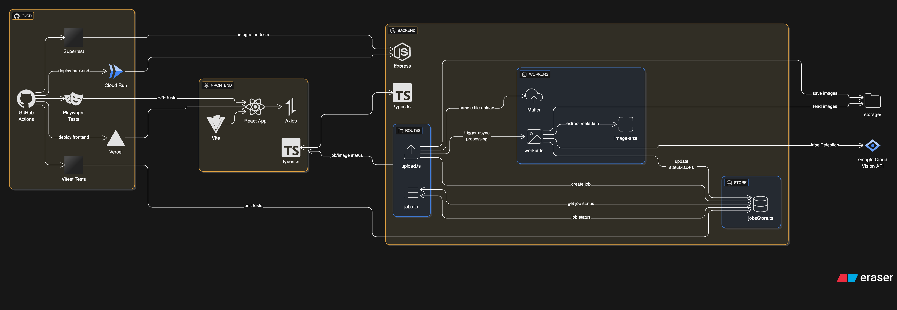

# Image Upload & Labeling Service

A fullstack TypeScript application that allows users to upload images, automatically extract metadata, and label them using Google Cloud Vision API.

## Architecture



## Features

- 📤 **Upload single or multiple images** with real-time progress tracking
- 🔄 **Asynchronous image processing** using Google Cloud Vision API
- 🏷️ **Automatic labeling** with object detection and scene classification
- 📊 **Metadata extraction** (file size, dimensions)
- 🖼️ **Image previews** with thumbnail display
- 📋 **Job tracking** view all uploads and their processing status
- ⚡ **Real-time updates** with automatic polling of job status
- 🎯 **Type-safe** fully typed frontend and backend with TypeScript

## Tech Stack

### Frontend
- **React 19** with TypeScript
- **Vite** for fast development and build
- **Axios** for API communication
- Type-safe interfaces shared with backend

### Backend
- **Node.js** with **Express**
- **TypeScript** for type safety
- **Google Cloud Vision API** for image labeling
- **Multer** for file uploads
- **image-size** for metadata extraction

## Project Structure

```
image-labeler/
├── frontend/
│   ├── src/
│   │   ├── App.tsx          # Main UI component
│   │   ├── types.ts         # TypeScript interfaces
│   │   └── main.tsx
│   └── package.json
├── backend/
│   ├── src/
│   │   ├── server.ts        # Express server setup
│   │   ├── routes/
│   │   │   ├── upload.ts    # Upload endpoint
│   │   │   └── jobs.ts      # Job status endpoint
│   │   ├── workers/
│   │   │   └── worker.ts    # Image processing logic
│   │   ├── shared/
│   │   │   └── types.ts     # Shared TypeScript types
│   │   └── store/
│   │       └── jobsStore.ts # In-memory job storage
│   └── package.json
└── storage/                  # Uploaded images directory
```

## Setup Instructions

### Prerequisites

- Node.js (v18 or higher)
- Google Cloud account with Vision API enabled
- Google Cloud service account JSON key

### Backend Setup

1. Navigate to the backend directory:
   ```bash
   cd image-labeler/backend
   ```

2. Install dependencies:
   ```bash
   npm install
   ```

3. Set up Google Cloud Vision API:
   - Create a project in Google Cloud Console
   - Enable the Vision API
   - Create a service account and download the JSON key
   - Place the JSON key file in `backend/` directory
   - Set the environment variable:
     ```bash
     export GOOGLE_APPLICATION_CREDENTIALS="path/to/your-key.json"
     ```

4. Start the development server:
   ```bash
   npm run dev
   ```
   
   The backend will run on `http://localhost:5001`

### Frontend Setup

1. Navigate to the frontend directory:
   ```bash
   cd image-labeler/frontend
   ```

2. Install dependencies:
   ```bash
   npm install
   ```

3. Start the development server:
   ```bash
   npm run dev
   ```
   
   The frontend will run on `http://localhost:5173` (or another port if 5173 is busy)

## API Endpoints

### POST `/api`
Upload images for processing
- **Body**: `multipart/form-data` with `images` field
- **Response**: `UploadJob` object with job details

### GET `/api`
Get all upload jobs
- **Response**: Array of `UploadJob` objects

### GET `/jobs/:id`
Get specific job status
- **Response**: `UploadJob` object

### GET `/images/:filename`
Serve uploaded image files
- **Response**: Image file

## Type Definitions

```typescript
interface ImageMeta {
  size: number;
  width: number;
  height: number;
}

interface ImageRecord {
  imageId: string;
  filename: string;
  status: "uploaded" | "processing" | "done" | "error";
  metadata?: ImageMeta;
  labels?: string[];
}

interface UploadJob {
  jobId: string;
  images: ImageRecord[];
  status: "pending" | "processing" | "done";
  createdAt: string;
  updatedAt: string;
}
```

## Implementation Notes

### Asynchronous Processing
- Images are uploaded immediately and return a job ID
- Processing happens asynchronously in the background
- Frontend polls the job status every 2 seconds for updates
- Each image is processed independently using `Promise.all()`

### Google Cloud Vision Integration
- Uses the `labelDetection` method to identify objects and scenes
- Extracts labels with confidence scores
- Handles errors gracefully with status updates

### Metadata Extraction
- File size extracted from `fs.stat()`
- Image dimensions extracted using `image-size` library
- Metadata stored separately from labels for clean data structure

### State Management
- Backend uses in-memory storage (for demo purposes)
- Jobs persist only during server runtime
- Production should use a database (MongoDB, PostgreSQL, etc.)

### Type Safety
- Shared type definitions between frontend and backend
- All API responses are type-safe
- Frontend uses `import type` for proper module syntax

## Future Enhancements

- [ ] Add database persistence (MongoDB/PostgreSQL)
- [ ] Implement user authentication
- [ ] Add image filtering and search
- [ ] Support batch download of labeled images
- [ ] Add confidence scores for labels
- [ ] Implement image deletion
- [ ] Add more vision API features (OCR, face detection, etc.)
- [ ] Add pagination for large job lists
- [ ] Export labels to CSV/JSON
- [ ] Add image cropping/editing before upload

## License

MIT
